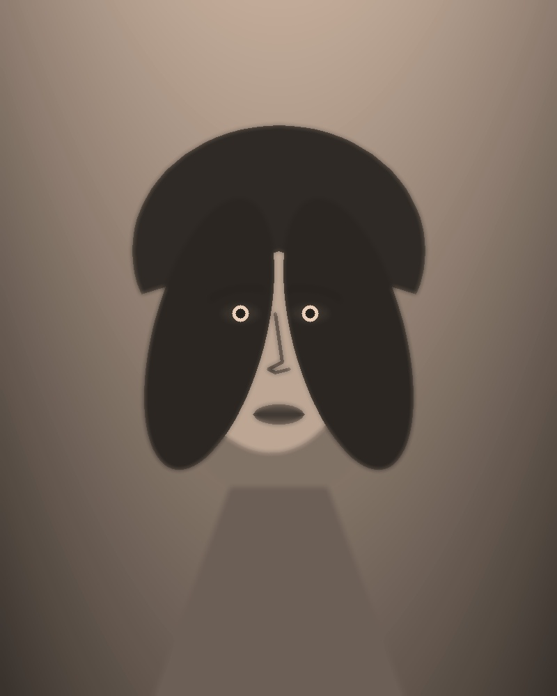

# PencilSketch AI ✏️

> An advanced, studio-grade full-stack web application that converts photos into realistic, handcrafted pencil sketches using **Python Flask**, **OpenCV**, **Pillow**, and modern responsive **HTML5/CSS3/JavaScript**.



---

## 🌟 Key Features

- 🎨 **5 Distinct Artistic Styles**:
  - **Realistic Graphite**: Classic HB/2B lead pencil with natural tone gradation and subtle paper grain.
  - **Soft Pencil**: Smooth, stump-blended shading with soft midtones wash.
  - **Dark Pencil**: Deep 8B carbon/graphite with enhanced CLAHE contrast and punchy dark accents.
  - **Charcoal**: Expressive rough texture, edge extraction, and smudged velvety blacks.
  - **Detailed Sketch**: Dual-pass dodge with unsharp masking for architectural and technical precision.
- ↔️ **Interactive Split Comparison Slider**: Smooth mouse and touch dragging slider allowing users to inspect before & after differences down to the pixel.
- 🔲 **Side-by-Side Mode**: Synchronized dual-panel layout for viewing original and sketch side-by-side.
- 🎛️ **Fine-Tuning Parameter Sliders**:
  - **Sketch Intensity** (10–100): Adjusts line weight and dodge blend intensity.
  - **Darkness / Contrast** (10–100): Custom gamma-curve and shadow depth.
  - **Stroke Detail** (10–100): Adapts Gaussian kernel radius for soft vs razor-sharp lines.
- ⚡ **Instant Sample Presets**: Includes built-in Portrait, Architecture, and Landscape demo images for 1-click testing.
- 🌓 **Adaptive Theme System**: Complete Dark Mode and Light Mode with seamless switching and `localStorage` persistence.
- 📥 **Export Options**: Download high-resolution PNG sketches or an automated side-by-side comparison graphic.
- 📱 **Fully Responsive**: Optimized for ultra-wide desktop monitors, laptops, tablets, and smartphones.

---

## 🛠️ Tech Stack

| Layer | Technology |
| :--- | :--- |
| **Backend** | Python 3.11+, Flask 3.1, Gunicorn, Werkzeug |
| **Vision & Image Processing** | OpenCV (`cv2`), Pillow (`PIL`), NumPy |
| **Frontend** | Vanilla HTML5, CSS3 Custom Properties, Vanilla JavaScript (ES6+) |
| **Typography** | Google Fonts (*Outfit*, *Plus Jakarta Sans*, *JetBrains Mono*) |
| **Deployment** | Render, Hugging Face Spaces, Docker |

---

## 🔬 How The OpenCV Pipeline Works

The image synthesis pipeline implements classical computer vision mathematical transformations:

1. **Grayscale Luminance Extraction**:
   $$\text{Gray} = 0.299 \cdot R + 0.587 \cdot G + 0.114 \cdot B$$
2. **Inversion**:
   $$\text{Inverted} = 255 - \text{Gray}$$
3. **Adaptive Gaussian Smoothing**:
   Applies a 2D Gaussian kernel with size dynamically scaled according to resolution and detail settings:
   $$G(x, y) = \frac{1}{2\pi\sigma^2} e^{-\frac{x^2+y^2}{2\sigma^2}}$$
4. **Color-Dodge Division**:
   $$\text{Dodge}(A, B) = \min\left(255, \frac{A \times 256}{255 - B + 1}\right)$$
5. **Graphite Tone Curve & Micro-Texture Synthesis**:
   Applies non-linear gamma lookup tables (`cv2.LUT`) and synthetic paper roughness noise.

---

## 📁 Project Structure

```text
pencil-sketch/
│
├── app.py                  # Flask server and API route handlers
├── sketch_engine.py        # Core OpenCV image processing algorithms (5 styles)
├── generate_presets.py     # Script generating built-in sample demo images
├── requirements.txt        # Python package dependencies
├── render.yaml             # One-click Render deployment configuration
├── Dockerfile              # Docker container file (Hugging Face Spaces)
├── README.md               # Documentation and deployment guides
├── .gitignore              # Git ignore rules
│
├── templates/
│   └── index.html          # Semantic landing page and sketch studio interface
│
├── static/
│   ├── css/
│   │   └── style.css       # Complete design system, dark/light themes, and slider
│   ├── js/
│   │   └── script.js       # Client-side events, AJAX upload, and slider logic
│   ├── presets/            # Built-in demo sample images (Portrait, Architecture, Landscape)
│   └── uploads/            # Temporary storage for user-uploaded source images
│
└── output/                 # Generated sketch outputs and comparison graphics
```

---

## 🚀 Local Installation and Setup

### Prerequisites
- Python 3.9 or higher (tested with Python 3.11, 3.12, and 3.14)
- Git

### 1. Clone or Open the Repository
```bash
git clone https://github.com/your-username/pencilsketch-ai.git
cd pencilsketch-ai
```

### 2. Create and Activate a Virtual Environment
**On Windows (PowerShell):**
```powershell
python -m venv venv
.\venv\Scripts\Activate.ps1
```

**On macOS / Linux:**
```bash
python3 -m venv venv
source venv/bin/activate
```

### 3. Install Required Dependencies
```bash
pip install -r requirements.txt
```

### 4. (Optional) Generate Demo Presets
```bash
python generate_presets.py
```

### 5. Launch the Flask Server
```bash
python app.py
```

Open your browser and navigate to:
```
http://127.0.0.1:5000
```

---

## 🌐 Free Cloud Deployment Guide

### Option 1: Deploy for Free on Render (Recommended)

Render offers a free tier for Python web applications:

1. **Push your code to a GitHub repository**:
   ```bash
   git init
   git add .
   git commit -m "Initial commit of PencilSketch AI"
   git branch -M main
   git remote add origin https://github.com/<your-username>/pencilsketch-ai.git
   git push -u origin main
   ```
2. Log into [Render.com](https://render.com).
3. Click **New +** → **Web Service**.
4. Connect your GitHub repository.
5. Set the following settings:
   - **Name**: `pencilsketch-ai`
   - **Environment**: `Python 3`
   - **Build Command**: `pip install -r requirements.txt && python generate_presets.py`
   - **Start Command**: `gunicorn --bind 0.0.0.0:$PORT --workers 2 --timeout 120 app:app`
   - **Plan**: `Free`
6. Click **Deploy Web Service**. Your live app will be accessible at `https://pencilsketch-ai.onrender.com`.

*(Alternatively, use Render's Blueprint by clicking **New +** → **Blueprint** and pointing to `render.yaml`).*

---

### Option 2: Deploy on Hugging Face Spaces (Free)

1. Go to [Hugging Face Spaces](https://huggingface.co/spaces) and click **Create new Space**.
2. Set Space name (e.g., `pencilsketch-ai`).
3. Select **Docker** as the Space SDK (Blank template).
4. Clone the space repo locally or push your existing files:
   ```bash
   git remote add hf https://huggingface.co/spaces/<your-username>/pencilsketch-ai
   git push hf main
   ```
5. Hugging Face will automatically read the included `Dockerfile`, install all dependencies, build the image, and serve it on port `7860`.

---

## 📡 API Reference

### 1. Upload Image
- **Endpoint**: `POST /upload`
- **Body**: `multipart/form-data` with `image` file OR `preset_id` (`portrait` | `architecture` | `landscape`)
- **Response**:
  ```json
  {
    "success": true,
    "file_id": "upload_abc123",
    "filename": "upload_abc123.jpg",
    "original_url": "/static/uploads/upload_abc123.jpg"
  }
  ```

### 2. Process Sketch
- **Endpoint**: `POST /process`
- **Headers**: `Content-Type: application/json`
- **Body**:
  ```json
  {
    "file_id": "upload_abc123",
    "style": "graphite",
    "intensity": 50,
    "darkness": 50,
    "detail": 50
  }
  ```
- **Response**:
  ```json
  {
    "success": true,
    "sketch_url": "/output/sketch_upload_abc123_graphite_i50_d50_dt50.png",
    "processing_time_ms": 78
  }
  ```

### 3. Download Result
- **Endpoint**: `GET /download?filename=<filename>&mode=<sketch|comparison>`
- **Response**: File attachment download (`.png`).

---

## 📄 License

Distributed under the MIT License. Free to use for personal, educational, and commercial portfolio projects.
